## Settings and Setup

- Always give the project an appropriate name.
- Use the High Contrast Colour Mode for improved readability.

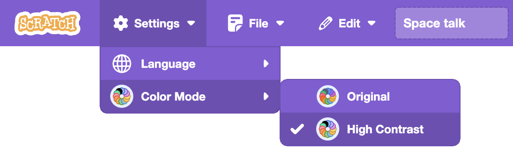

## Editor Terminology

- Follow these provided naming conventions for consistency. 
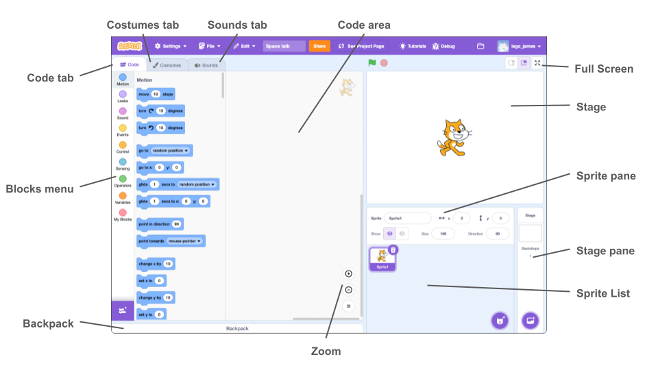

## Naming Conventions

- **Sprites and Backdrops:** Use descriptive names reflecting their role or appearance. Rename defaults like "sprite1" to "hero" or "player".
- **Case:** Use lower case for all names. Separate words with spaces rather than underscores or capital letters.
- **Variables and Lists:** Choose clear and descriptive names, such as "score" or "enemy list".


## Organisation of Code

- **Scripts Arrangement:** Organise scripts logically, grouping related blocks together to enhance readability and debugging.
- **Use of Comments:** Utilise Scratch's built-in comments on blocks when necessary, particularly in starter projects or instructions, to provide additional clarity.

  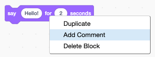

  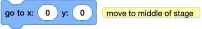

## Event Handling

- **Single Event Listener:** Prefer using one *when green flag clicked* block per sprite to initiate actions. Manage multiple behaviours within this script using control blocks.
	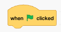
- **Broadcasting Messages:** Utilise broadcasts to communicate clearly between sprites. Name broadcasts meaningfully.

## Control Structures

- **Loops:** Use *repeat* or *forever* loops appropriately. Ensure loops have clear exit conditions to prevent infinite loops unintentionally.
	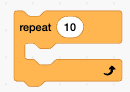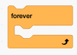
- **Conditional Statements:** Use *if..then* and *if..then..else* blocks for clear and simple decision-making logic.
	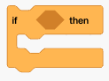 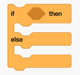

## Motion and Positioning

- **Coordinate System:** Be mindful of Scratch’s coordinate system, where 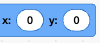 is the centre. Clearly position sprites using x  and  coordinates.
- **Initialisation:** Always initialise x,y  positions and  using code blocks, rather than by using the user interface.
  
  
  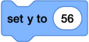
  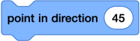

- **Rotation Style:** Set rotation styles appropriately using code blocks (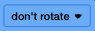,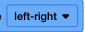, or 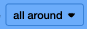) for expected behaviour during motion.

  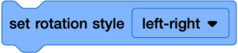

## Looks and Sounds

- **Costume Naming:** Clearly name costumes based on their purpose or action, like "walking 1" or "jumping pose".
- **Sound Management:** Name sounds based on function (e.g., "jump sound", "background music"). Keep audio clips concise to maintain performance.
- **Initialisation:** Always initialise  using code blocks, rather than by using the user interface.

  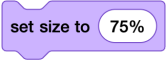

## Variables and Lists

- **Scope:** Determine appropriate scope (sprite-specific or global) based on usage context. Use **global** scope as default unless sprite-specific is absolutely required.
- **Initialisation:** Always initialise variables at the beginning of scripts to ensure they have defined initial values.

  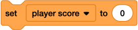

## My Blocks

> [!WARNING]
> Avoid the use of My Blocks unnecessarily.
> - They can add **[cognitive load](QR01.md)** and make projects harder to follow.  
> - Many tasks are already covered by existing Scratch blocks, adding custom blocks may create duplication and confusion.  
> - Overuse reduces clarity: students may struggle to see how actions map directly to Scratch’s core blocks.  

- **Purpose:** Use My Blocks only for repetitive code or complex functionalities, promoting modularity. 
- **Naming:** Name My Blocks descriptively, clearly indicating their function, such as "move to start position" or "check collision".

## Instructional style

**Highlighting**: Highlight text that refers to a block using the colour associated with that block. (e.g) , 

**Sprite identity**: Include an image of the sprite that the script is attached to.

  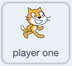

  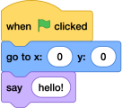

**Scratchblocks**: Use [Scratchblocks](https://scratchblocks.github.io/#?style=scratch3&script=) to create PNG code blocks for online use or SVG code blocks for printed use. Save the code used for easy maintenance of the instructions. 

Scratchblocks can be saved as a [URL](https://scratchblocks.github.io/#?style=scratch3&script=when%20flag%20clicked%0Ago%20to%20x%3A(0)%20y%3A(0)%0Aturn%20cw%20(15)%20degrees%0Asay%20%5Bhello%5D%0A), for example:

```html
https://scratchblocks.github.io/#?style=scratch3&script=when%20flag%20clicked%0Ago%20to%20x%3A(0)%20y%3A(0)%0Aturn%20cw%20(15)%20degrees%0Asay%20%5Bhello%5D%0A
```

## Text Highlighting

Scratch palette for text highlighting:

| Block type | Colour                                                                                                                                                                 |
| ---------- | ---------------------------------------------------------------------------------------------------------------------------------------------------------------------- |
| motion     |  |
| looks      |  |
| sound      |  |
| events     |  |
| control    |  |
| sensing    |  |
| operators  |  |
| variables  |  |
| myblocks   |  |
