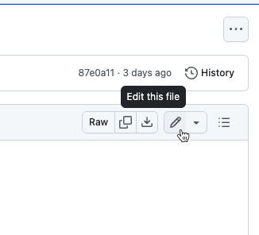
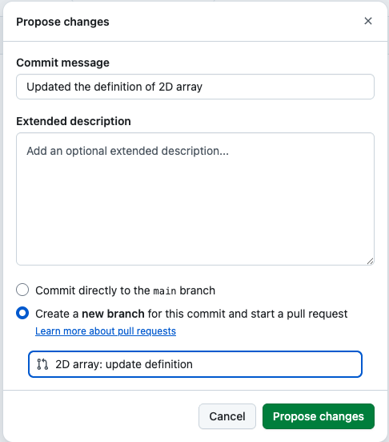

**For when you want to:** make changes to existing files, or add new single files or directories. 

Before you can edit on GitHub, you require write access permissions on the [GitHub repository](https://github.com/RaspberryPiFoundation/teaching-learning-documentation). Speak to the **Development & Practice team** for support if needed.

This method is web-based, you won't need any additional software. 

### Example workflow:

To change content on a page (for example, [2D Arrays](https://github.com/RaspberryPiFoundation/teaching-learning-documentation/blob/main/content/Glossary/terms/2D%20array.md)):

- When viewing the page on GitHub, click on the pencil icon (top right) to edit this file.

* [Markdown](https://docs.github.com/en/get-started/writing-on-github/getting-started-with-writing-and-formatting-on-github/basic-writing-and-formatting-syntax) is used to format the text.

- Once done, click on the green “Commit changes…” button top right.

In the propose changes box:

* Under **commit message**, you write a comment on the changes you have made. It's good to be specific.
* Select 'create a **new branch** for this commit', and in the box below, enter a name for the changes you are proposing.
* Select *Propose changes* and your changes will be submitted for review.

If you want to contribute more regularly or across multiple pages, contact the Development & Practice team.