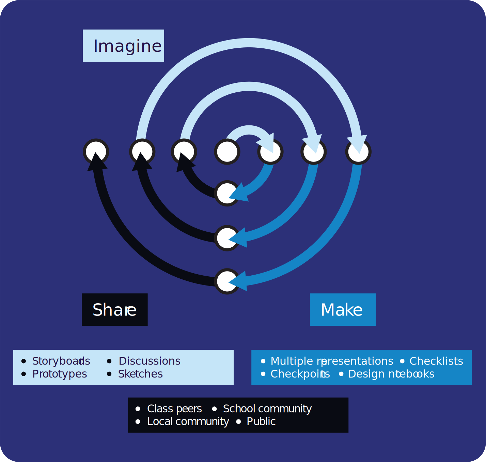

Project-based learning (PBL) is an approach to teaching computing where the learning activities are organised around the design, creation, and evaluation of a digital artefact. It is based on the premise that learners deepen and consolidate their knowledge through hands-on, tangible experiences that allow them to reflect on their learning [^1]. 

> [!example]- Summary
> It can be helpful to use PBL in the classroom so that learners can apply their existing computing knowledge to new situations and deepen their understanding of programming concepts. PBL can also help learners develop skills valued by employers in the workplace, such as planning, organisation, and communication [^2].
> 
>  Projects usually take place over a number of sessions and will typically be split into several stages:  
>  
>  - **Imagine** — developing an idea of something to make, and planning the resources needed
>  - **Make** — building and testing the digital artefact, with the goal of realising the original idea
>  - **Connect/share** — sharing the project with an audience to elicit feedback, and reflecting on what has been learnt during the project
>  
>  In practice, the stages of PBL may not be implemented linearly. More often, they are part of an iterative process in which some stages are repeated one or more times.
>  
>  PBL often involves using a mixture of software, hardware, and other physical material. The hands-on element of the project can help learners to more easily connect their digital artefact with their learning and to better track their progress.

## Creating a strong project concept

The choice of project is key to successful learning. Research has shown that a successful digital project requires the combination of a well-researched idea, access to available technology, and an appropriate level of skills [^3].

 A strong project idea often has a personal dimension that aligns with the learner’s own interests. The aim of the project is then to create something of value to the learner, or to solve a real-world problem that the learner has identified as important. In this phase, creating a storyboard, sketch, or design for the project helps learners to shape a realistic, visible project concept aimed at a particular set of users or the performance of a specific function.
 
 Educators have an important role to play by designing thoughtful prompts to encourage project ideas. A good project prompt is brief and solvable, yet contains enough ambiguity so that the learner can “satisfy the prompt in their own voice” [^4].

## Supporting productive project development

Project-based learning is cognitively rich [^5], that is, it requires both technical thinking about the code (and perhaps the hardware), and organisational thinking about the development of the project. One challenge for learners in PBL is the transfer of conceptual programming knowledge into the skills required to write their own programs. It can be equally as difficult to manage time spent on the project to make sure that there is progression from start to finish.

 Educators can refer to previous activities, such as [worked examples](QR02.md) and Parson’s Problems, to support conceptual transfer. Multiple representations, such as side-by-side algorithmic and coded solutions, can help students identify patterns in the structure and generalise these to use in their own projects.
 
 Tools such as individual or class checklists, checkpoints where teacher approval is required, and design notebooks for planning and reflection can scaffold the development of learners’ project management skills, as well as helping educators to keep an overall sense of progress [^6].
## Sharing projects with others

Projects are made for people to use. Testing, presenting, and eliciting user feedback help learners to shape their project and identify potential improvements.

 The project audience can be:
 
 - **In the classroom** — obtaining peer feedback from other learners
 - **In the school community** — presenting at an assembly or to older or younger learners 
 - **In the wider community** — obtaining feedback from parents or community groups 
 - **Public** — via the appropriate use of social media or the school website, or by entering projects into exhibitions, showcases, or competitions

## Assessing project-based learning

Artefact-based questions (ABQs) support assessment for learning (AfL), because as learners reflect on their project, they also reflect on what they have learnt. ABQs can be about:

 - **The project** — why was this project chosen? What was the original concept?
 - **The code** — what does this section of the code do? Why have you taken this approach?
 - **The process** — which part of the project was most successful? What changed during the project development?
 - **The outcomes** — did you make what you planned to? How did user feedback shape your artefact?
 
 At the end of a project, learners may still have areas of uncertainty, and questions of their own. Connecting their learning back to the wider knowledge domain of the scheme of work or curriculum can help to situate their learning in context. Note that failure to make these links can reproduce inequities in access and opportunity [^7].
 
[Online PDF](https://the-cc.io/qr15)

### References

[^1]: Papert, S. (1980) [*Mindstorms: Computers, children, and powerful ideas.* ](http://the-cc.io/qr15_5)New York, Basic Books.
[^2]: Menzies, V., Hewitt, C., Kokotsaki, D., Collyer, C. & Wiggins, A. (2016) [*Project Based Learning: evaluation report and executive summary.*](http://the-cc.io/qr15_6) Education Endowment Foundation.
[^3]: Quinlan, O. & Sentance, S., (2020) [Ideas, Technology and Skills: A taxonomy for digital projects](http://the-cc.io/qr15_7). In: Tangney, B., Byrne, J. R. & Girvan, C. (eds.) *Constructionism 2020, the University of Dublin. Trinity College Dublin, Ireland, May 26-29, TARA, 2020*. Pp 357-365.
[^4]: Martinez, S. L. & Stager, G. (2013) [*Invent to Learn: Making, Tinkering, and Engineering in the Classroom.* ](http://the-cc.io/qr15_8)Torrance, California, ConstructingModern Knowledge Press.
[^5]: Vossoughi, S. & Bevan, B. (2014) *[Making and Tinkering: A Review of the Literature.](http://the-cc.io/qr15_9)* Successful Out-of-School Learning: A Consensus Study, National Research Council Board on Science Education (pp 1–55).
[^6]: Fields, D. A. & Kafai, Y. B. (2020) [Hard Fun With Hands-On Constructionist Project Based-Learning.](http://the-cc.io/qr15_10) In: Grover, S. (ed.) *Computer Science in K–12: An A to Z handbook on teaching programming* (pp 75–82). Palo Alto, Edfinity.
[^7]: Vossoughi, S., Escudé, M., Kong, F. & Hooper, P. (2013) *[Tinkering, Learning & Equity in the After-School Setting]*(http://the-cc.io/qr15_11). Paper presented at FabLearn2013, 27–28 October 2013, Stanford, CA. 
#### 

