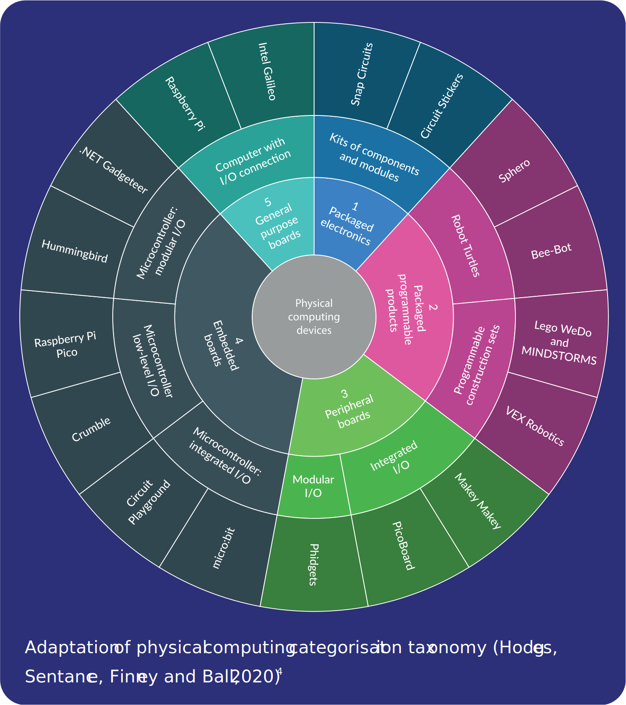

By embedding physical computing into their practice, educators can provide engaging, relevant, and inclusive learning experiences. Such experiences can help learners to develop and apply their programming skills and comprehension while they are being creative and collaborative.

> [!example]- Summary
> ###Physical computing:###
> 
> * Uses specialist hardware to interact with the real world
> * Involves writing programs to control output devices (lights, buzzers, motors, etc.)
> * Allows learners to record and measure the environment through buttons and sensors
> 
> ###Benefits:###
> 
> * It provides a holistic experience of computing that combines hardwareand software
> * It may support program comprehension by providing physical clues to a program’s purpose
> * It develops broader skills involving collaboration, design, and prototyping
> * It connects to subjects beyond computing
> 
> ###Relevance and inclusion:###
> 
> * Physical computing can provide opportunities for a broad range of learners
> * Learners (particularly girls) find physical computing engaging
> * There are opportunities to vary the context and level of challenge (high ceiling, low flow, wide walls)
> * It provides space for learners to be expressive and creative

## What is physical computing?

Physical computing is a broad term to describe activities where learners write programs to interact with the real world using specialist hardware. While there are many examples of physical computing devices, they are typically able to do a combination of some, or all, of the following:

* Control a simple output component, such as lights and buzzers
* Measure or record the environment in some way, including through sensors, buttons, and switches
* Drive and control motors to create movement

To help educators understand the different features of devices across this ecosystem, Hodges (et al)[^1] present a categorisation taxonomy which provides a broad distinction between devices. When considering what device(s) to work with, educators should review the features, connection method, and means of programming, as well as the flexibility that each device provides.

## Benefits to learners
In addition to the engaging nature of physical computing, there is emerging evidence of its
learning benefits within computing and beyond. Learners typically experience programming
by using high-level languages and producing screen-based applications, independent of the hardware on which they run. Physical computing can promote a broader perspective,bridging learners’ theoretical knowledge of how the hardware works and their program writing skills.

There is some evidence that physical computing activities can support a learner’s program comprehension,[^2] particularly in relation to the purpose and function of a program. The physicality of the project provides clues as to the intended purpose of a program, as well as how it is likely to work.

Depending on the context and the approach of a project, learners are also able to develop broader, more holistic skills that involve collaboration, communication, design, and prototyping. Physical computing projects are typically situated within meaningful contexts (e.g. plant  monitoring, social enterprise, or even performance), which helps learners to develop their
understanding of subjects beyond computing.to keep an overall sense of progress.

## Relevance and inclusion

The last decade has seen a growth in computing across a range of educational
settings. Whether through formal education and curricula, or the many clubs,
competitions, and other non-formal settings, there are many more opportunities for young people to learn about and develop the knowledge and skills associated with computing. Despite this growth, there are significant challenges ahead for educators in how they address the equity, inclusivity, and relevance of computing. There are still groups within our increasingly diverse
learners that are underserved, including girls and ethnic minorities.

As an approach, physical computing is established as a highly motivating experience for learners,[^3] particularly due to its tangible and interactive outcomes. This positive response can be broadly observed in learners engaging with physical computing, including traditionally underserved minorities. Girls, in particular, have reported higher levels of confidence in
computing following physical computing activities.[^4]

Physical computing provides an interactive experience for learners, with real and immediate feedback. In line with constructivist learning theory, there is a tangible artefact for learners to touch, manipulate, observe, and build, which can help develop their confidence. Physical computing can also promote greater intrinsic motivation within learners through more practical and relevant examples of computing, allowing them to solve problems that matter to them and express their own cultural identity. Additionally, physical computing can be applied to a wide range of scenarios with some very accessible starting points and plenty of advanced concepts to explore. This breadth and depth facilitates choice, progression, and creativity for learners.

## Getting started: hardware, content, training

Getting started with physical computing can be a rewarding experience for learners, but it is not without its challenges. Educators should consider the following:

* Start small. Focus on a small cohort, an individual concept, or a single activity or lesson.
* Is there suitable content that already exists and is available for you to use and adapt?
* Is there any training available to support you?
* Are there other educators locally who you could collaborate with or observe?
* With the above in mind, which devices would best suit your immediate needs and allow for  maximum future flexibility?
Can you borrow the equipment before you buy it?

As an educator, adopting physical computing can be an engaging and highly beneficial experience for your learners. While this journey is not without its challenges, there has never been as many device options, support, or content available as there is today.

[Online PDF](https://the-cc.io/qr16)

### References

[^1]: Hodges, S., Sentance, S., Finney, J., & Ball, T. (2020). Physical computing: A key element of modern computer science education. Computer, 53(4), 20-30.
[^2]: Jayathirtha, G., & Kafai, Y. B. (2021, June). Program Comprehension with Physical Computing: A Structure, Function, and Behavior Analysis of Think-Alouds with High School Students. In Proceedings of the 26th ACM Conference on Innovation and Technology in Computer Science Education V. 1 (pp. 143-149).
[^3]: Przybylla, M., & Romeike, R. (2018, November). Impact of physical computing on learner motivation. In Proceedings of the 18th Koli Calling International Conference on Computing Education Research (pp. 1-10).
[^4]: Sentance, S., & Schwiderski-Grosche, S. (2012, November). Challenge and creativity: using .NET gadgeteer in schools. In Proceedings of the 7th Workshop in Primary and Secondary Computing Education (pp. 90-100).

