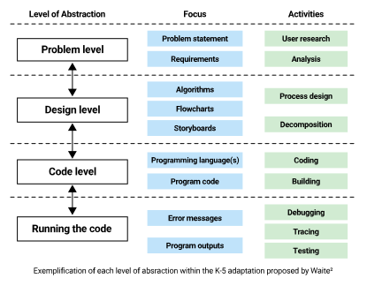

Abstraction is acknowledged as one of the key concepts in computational thinking, and the programmer’s ability to successfully move between different levels of abstraction is a central skill. The researcher Jeannette Wing emphasised that “thinking like a computer scientist means more than being able to program a computer. It requires thinking in multiple levels of abstraction”[^1]. 

Learning to program involves far more than understanding the syntax and semantics of a programming language. Programming also involves being able to:

* Understand, or clearly state, the task or problem that is being addressed
* Design a solution to the problem and create an algorithm
* Implement (code) an algorithm in an appropriate programming language
* Run and debug the program

Teaching all of these skills at once greatly increases the [cognitive load](QR01.md) placed on learners.

> [!example]- Key concepts
> ### Key concepts ###
> 
> When teaching learners how to design and create computer
> programs, we must also teach them how to abstract information[^2].
> 
> The Levels of Abstraction hierarchy model defines 4 discrete levels that programmers move between.
> 
> * This hierarchy enables teachers and learners to describe which level they are working at.
> * Learners who are aware of the level they are working in have the opportunity to become more skilled at moving between the different levels and may become more effective programmers[^3].

## What is abstraction?

Abstraction is the ability of the programmer to adjust their focus while they develop a programmed solution. The programmer needs to be able to move between the goals of the task, their design for a solution, the building and coding of a program, and the behaviour of that program when it runs. Each of these focuses can be considered a different abstraction of the problem as a whole, and each requires different skills and amounts of information to be considered by the programmer[^4].

### Defining the levels ### 
 
Perrenet, Groote and Kaasenbrood investigated learners’ understanding of the concepts of algorithms[^5]. From this they defined a hierarchy of levels of abstraction. The work of Perrenet et al. has been the focus of many further studies and the defined levels of abstraction have been refined along the way. In 2018, Waite et al. built upon the work of Perrenet et al.[^5] and Statter and Armoni³ and adapted the levels for learners in the K-5 age range, simplifying the language used to support understanding by K-5 teachers and learners[^6]

## The levels in detail

| Level                                  | Description                                                                                                                                                                                                                                                                                                                                                                                                                                                                                                                                              |
|----------------------------------------|----------------------------------------------------------------------------------------------------------------------------------------------------------------------------------------------------------------------------------------------------------------------------------------------------------------------------------------------------------------------------------------------------------------------------------------------------------------------------------------------------------------------------------------------------------|
| Problem level                          | The problem level is a high level written or verbal description of the project. It could be a short paragraph that describes and defines what the requirements of the project are, for example “Create a quiz program to test 8 - 9 year old children on their times tables”. When completing this level for more complex problems it may well need to be more than just a short paragraph.                                                                                                                                                              |
| Design level (including the algorithm) | In the design level a written, verbal or drawn depiction of the project is created. This should be more detailed than the problem definition, but should not refer to the code that could be used to implement it. The format of the design should be adapted to match the requirements of the project. For example a storyboard or flow chart could be created depending on the type of project. It is at this level that the algorithm is developed. It is important that the language used at this level is not specific to any programming language. |
| Code level                             | In this level the design is implemented (coded) in a suitable programming language(s). As well as developing the program code, this level could contain verbal or written reference to particular programming languages and constructs would occur. In a [physical computing](QR16.md) project, this level would also contain the building of the physical elements of the project.                                                                                                                                                                                 |
| Running the code level                 | At this level the programmer is focused on running the code and the outputs of the program. It is at this level that debugging of the coded solution happens and could be recorded in some manner, through observations or tests for example “When answering a question correctly the score increased by two”.                                                                                                                                                                                                                                           |

## Using the hierarchy in your classroom

A number of guidelines for using the Levels of abstraction framework with your learners have been suggested throughout the research into this topic:

* Be persistent and precise: Be careful not to mention multiple levels together. For example, when working in the Problem level, elements of “how” the problem may be solved should not be discussed; these belong in the level below[^7].
* Have clear distinctions between each level: By using language that is specific for its level, learners will understand the boundaries of the levels better and are more likely to recognise when they are moving between the levels[^7].
* Learners should begin at the highest level of abstraction they are working with and then be supported to consciously move between levels, both up and down, throughout the programming process[^7]. For example, learners may need to match a running program to a problem, or code to a design.

## Language

With any new topic being introduced, learners’ understanding of the new vocabulary introduced is vital to their progression in the subject. By using language that is specific to the level of abstraction you are working in, you can help learners avoid confusion. For example, names of programming languages should only be used when you are in the “Code” level. If  you were using Scratch you could use the specific term “broadcast” when in the “Code” level but when you were “design” level a more appropriate term would be “inform”[^7].

[Online PDF](https://the-cc.io/qr24)
### References

[^1]: Wing, J. (2008). Computational thinking and thinking about computing. the-cc.io/qr24_1
[^2]: Waite, J. L. (2024). Teaching the design of K-5 programs: a practitioners’ view and a design toolkit for teachers and researchers. the-cc.io/qr24_2
[^3]: Statter, D., and Armoni, M. (2020). Teaching abstraction in computer science to 7th grade students. the-cc.io/qr24_3
[^4]: Raspberry Pi Foundation. (2022). Programming and algorithms within the Computing Curriculum. the-cc.io/qr24_4
[^5]: Perrenet, J., et al. (2005). Exploring students’ understanding of the concept of algorithm. the-cc.io/qr24_5
[^6]: Waite, J. et al.. (2018). Abstraction in action: K-5 teachers’ uses of levels of abstraction, particularly the design level, in teaching programming. the-cc.io/qr24_6
[^7]: Nakar, L., and Armoni, M. (2023). On teaching abstraction in computer science: secondary-school  teachers’ perceptions vs. practices. the-cc.io/qr24_7