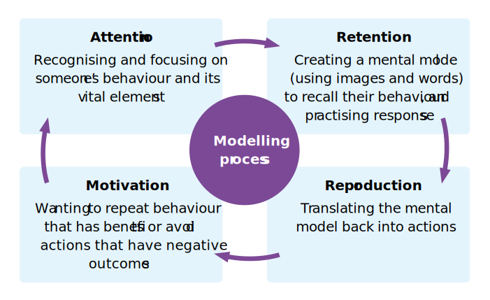

**Social** learning is a process of gaining new knowledge, attitudes, and behaviours
by interacting with and observing others. It’s an essential learning method that is
practised worldwide, and at every life stage. This Pedagogy Quick Read explores
why and how to create social learning opportunities for young people and adults in
education or training sessions, online or in person. 

> [!example]- Social learning lncludes:
> ###**Active learning**, such as:###
> • Taking part in a debate
> • Collaborative tasks, like editing a wiki
> • Think-pair-share activities (consider a topic, discuss
> it with a partner, share your thoughts with a group)
> • Collective problem-solving
> 
> ###**Passive learning**, such as:###
> • Considering comments on a blog post
> • Reviewing case studies
> • Listening to a presentation
> • Watching someone perform a task (via video or in person)
> 
> ###Benefits###
> • Improved **understanding** and **knowledge** recall
> • Stronger **people skills**, like collaboration and teamwork
> • More **appealing, motivational**, and **enjoyable** learning experiences
> • Quickly building **real-world skills** and knowledge
> • Greater **empathy** and **understanding** of other people
> 
> ###What’s needed?###
> To generate the right environment for social learning, you need to:
> • Create a **safe, welcoming space**, where people feel comfortable being themselves
> • Encourage **open communication** and **active involvement**
> • Build a culture of **trust** and **respect**, where all contributions are welcome
> • **Lead by example**: Model behaviours you want to see, keep discussions balanced, ask thoughtful questions, and praise learners who take part effectively

## What is social learning?

Put simply, it’s any learning that involves other people. If you have listened to a podcast, played a team sport or online game, or taken part in a Q&A session, you have probably learnt socially without realising it!

Social learning involves modelling: observing and imitating the behaviours of
others. This means you learn “either deliberately or inadvertently, through the
influence of example”[^1]. Some complex behaviours, like speech, can only be learnt through modelling.

Albert Bandura, the main thinker behind **social learning theory**[^1], suggested that modelling is guided by four related processes:

1. **Attention**: Paying attention to, or recognising, the essential features of someone’s behaviour 
2. **Retention**: Creating a mental image and description to help you recall what you observed; practising responses (mentally or actively)
3. **Reproduction**: Turning your mental model and rehearsed responses back into actions 
4. **Motivation**: Having a good reason to repeat (or avoid) the behaviours, depending on the rewards or punishments involved
## What makes it effective?
- **Interactions**: Dynamic exchanges between people (e.g. discussing a question, sharing tips, or mentoring)[^2] 
- **Collaboration**: Working with others towards a common goal (e.g. group work or project-based activities)[^3]
- **Social environment**: Creating an inclusive, environment; welcoming diverse ideas and approaches 
- **Active engagement**: Paying attention, joining in, sharing experiences, and asking questions

## Social learning examples
Lessons and training sessions (even online ones) offer some exciting opportunities for social learning, such as:

**Collaborative problem-solving:** In a computing lesson, learners could identify a problem that they would like to solve in their local area. They would then assign roles and design, test, build, and troubleshoot a system or tool to solve that
problem. In a training session, this could involve discussing real-life issues educators face and ways to address them.

**[Peer instruction](QR04.md):** Set a multiple-choice question, and ask everyone to individually vote on their answer. In small groups, they discuss their answers and reasoning, aiming for a consensus. They then vote on the question again, according to
what their group agreed. This is followed by a wider discussion involving the entire group about the different answers. See the ‘[Peer instruction](QR04.md)’ Pedagogy Quick Read to learn more.

**Creating shared digital resources:** Provide information on several topics that everyone needs to understand, or have learners conduct their own research. Assign each topic to a pair or small group. Ask them to build a digital resource to explain it to the whole group, and then present it. By the end, everyone should
understand each topic and have resources to refer back to.

**Peer review and feedback:** Set a task for learners or trainees that can be shared. Model constructive and specific feedback, and then pair them up to review and provide feedback on each other’s work and suggest improvements.

## The facilitator’s role
- Provide clear expectations and instructions
- Make social learning essential to achieving learning objectives
- Offer different ways to join in with activities, so everyone is included
- Encourage and allow time for reflection
- Make creative use of available resources
- Model helpful behaviours and approaches
- Create a culture where learners can take risks and ask questions
- Focus on relationship-building

## What are the benefits?
Positive social learning experiences lead to better educational and training outcomes, improved social skills, and more emotional engagement with learning and with other people. These benefits include:

- Deeper understanding and a greater ability to remember knowledge long term
- Faster, more motivating, and more engaging learning experiences, allowing complex concepts and skills to be learnt more easily
- Development of social and emotional skills (e.g. empathy, compromise, and self-regulation)[^3]
- Building higher-level thinking skills (e.g. problem-solving, conflict resolution, and critical thinking)[^4]
- Better communication skills (e.g. providing clear instructions, active listening, and giving feedback)[^4]

## Theoretical origins
Humanity owes its success to its unique ability to learn from others. People were  learning socially long before formal learning theories existed. In fact, thinking about learning as a social process stretches back to ancient philosophers like Confucius, Plato, and Aristotle, and likely even earlier. 

In the mid-20th century, the leading ideas around learning focused on gaining knowledge through direct experience. Albert Bandura, the main developer of social learning theory[^1], added to this thinking by suggesting that both direct experience and observation could lead to learning. 

In his seminal Bobo doll experiments (1961–63), Bandura researched whether young children (aged 3–6) would imitate aggressive behaviour modelled by an adult. Confirming this formed the foundation for social learning theory. 

Bandura’s original theory focused on learning by observing behaviours and imitating them. Later, he developed this into social cognitive theory[^5], which also emphasises the thinking processes involved: analysing the outcomes of the observed behaviours, and deciding whether and when to reproduce them. 

Social cognitive theory highlights that learning is a complex, ongoing process influenced by personal factors (e.g. beliefs, expectations, or emotions), behaviours, and environment

[Online PDF](https://the-cc.io/qr27)
### References

[^1]: Bandura, A. (1977). Social learning theory. the-cc.io/qr27_1 
[^2]: Reed, M.S. et al. (2010). What is Social Learning? the-cc.io/qr27_2 
[^3]: Laal, M. and Ghodsi, S.M. (2012). Benefits of collaborative learning. the-cc.io/qr27_3 
[^4]: Wan Husssin, W.T.T. et al. (2019). Online interaction in social learning environment towards critical thinking skill: A framework. the-cc.io/qr27_4 
[^5]: Bandura, A. (1986). Social foundations of thought and action: a social cognitive theory. the-cc.io/qr27_5

