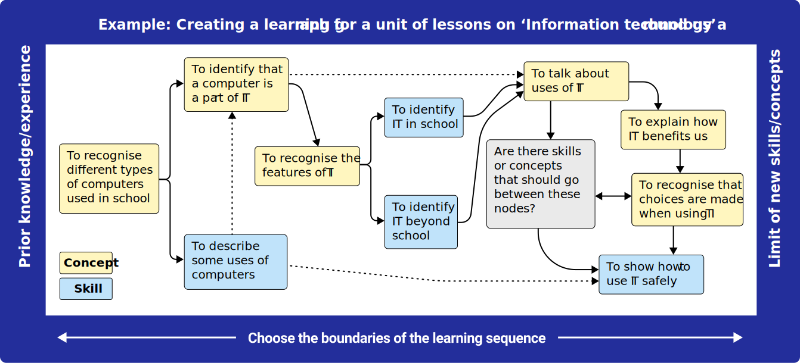

Learning graphs are a powerful tool for planning and visualising a sequence of lessons. They provide a clear and structured way to see how different concepts and skills connect and build upon one another[^1]. Unlike a linear topic list, a learning graph shows a true, non-
linear progression of a subject — a core idea in research on learning trajectories[^2]. This makes them an invaluable aid for educators.

> [!example]- Summary
> Learning graphs are a visual tool for planning a series of lessons, revealing how concepts and skills are interconnected rather than linear.
> 
> ###What learning graphs are: 
> * A network of ‘nodes’ (concepts and skills) and ‘links’
> 
> ### Key benefits of learning graphs:
> * Help educators visualise progression
> * Help identify curriculum gaps
> * Support the use of consistent terminology
> * Can be used for analysis to validate a learning journey
> 
> ### How to use learning graphs:
> * Creating learning graphs is a collaborative process that involves working backwards from learning goals and forwards from prior knowledge
> * When adapting content, educators can use learning graphs to help shape the adaptation by pruning or adding nodes
> 

## The research behind learning graphs

Learning graphs are a type of visual aid for curriculum planning that builds on existing research into ‘learning progressions’ and ‘knowledge maps’[^3]. While these approaches often focus on theoretical models, learning graphs are a practical, empirically driven tool that educators can use to actively design and validate a curriculum.

This hands-on approach has been (in our experience) incredibly flexible, and has been used to great effect in a variety of contexts around the world. From designing learning materials for vocational qualifications in one country to tailoring content for a new cultural context in another, the learning graph serves as a guide for shaping and restructuring learning experiences.

Recent research has focused on applying a similar approach to computational thinking, identifying the ‘learning trajectories’ or paths learners may follow to develop their understanding of core concepts like sequencing, iteration[^4], and decomposition[^5]. This work is part of a broader effort to establish computer science as a core STEM discipline with its own well-defined educational pathways[^6].

## Collaborative creation of learning graphs

The process of building a learning graph is as, if not more, valuable than the finished product. It is a collaborative process that forces educators to think critically about the relationships between different components of their curriculum, a practice that aligns with what researchers term “learning trajectory based instruction”[^7]. This process also helps to highlight potential gaps or areas that need more scaffolding. The design process has strong links to the [ABC learning design](https://the-cc.io/qr25) approach and the creation of [[[QR07|concept maps]]](http://the-cc.io/qr07), which are also used for curriculum planning.

Building a learning graph often involves working from both the beginning and the end of the learning sequence that is being planned. First, you identify the key **knowledge-based concepts**
and **skills** that learners must acquire by the end of the series of lessons. Then, you identify where learners are starting from.

After these start and end points have been identified, you work forwards and backwards between these points, considering which key concepts or skills need to be covered to get from the beginning to the end.

Once the key skills and concepts have been determined for the series of lessons (these form the ‘**nodes**’ of the graph), you connect them (these are the ‘**links**’) until you have a complete
graph. Some links may be hard dependencies, showing essential prerequisite knowledge, and these are depicted as solid lines. Other connections may represent knowledge or skills that are helpful, but not essential, and these are depicted as dotted lines. Making appropriate connections is an iterative process and can take several passes.

### Learning graphs for curriculum design, adaptation, and assessment

Some research into learning progressions[^8] compares learning to a series of stepping stones that learners can navigate across using different paths. Learning graphs help visualise the
multiple different routes learners may take in developing their understanding and application, and educators and curriculum designers can track or predict the routes most commonly taken
by learners and use this to inform their curriculum design. In this way, learning graphs can act as a map of possible paths through a topic or qualification and provide clear, competency- based pathways for learners. In addition, learning graphs can help to identify the ‘[learning episodes’ needed to teach the concepts](https://the-cc.io/qr06) within the learning sequence.

The flexibility of learning graphs makes it easy to adapt content for different groups of learners. For example, if you are adapting a unit of work for a new context (e.g. a specific qualification), you can prune any nodes that are not relevant to that context. You can then add in any supplementary knowledge and skills that are required, slotting them into place within the existing progression. You can then use this new learning graph to guide the redevelopment of the unit.

Learning graphs can also serve as a useful tool for formative assessment, allowing educators to pinpoint a learner’s current understanding and identify the next logical step in learning[^9].

### Learning graphs for analysis

A key benefit of learning graphs is that they can be explored from different angles to support different types of analysis. Once you have a core graph of interconnected knowledge and skills, you can map other information onto the nodes using colour coding. For example, you could map nodes to Bloom’s taxonomy, allowing you to analyse and verify that the progression of skills and knowledge is building in complexity. This approach provides a powerful way to validate the learning journey and ensure it is fit for purpose.

Connecting multiple graphs together helps curriculum designers identify overlap or  inconsistencies between connected sequences of lessons. This can also help uncover broader themes of progression and highlight alternative learning pathways.

On a larger scale, the philosophy of a validated, interconnected map of concepts is exemplified by initiatives like the [Cambridge Mathematics Framework](https://the-cc.io/qr28_10), a comprehensive, research-informed map of mathematical ideas that can be used to support the design and review of curricula and learning materials.

[Online PDF](https://the-cc.io/qr28)
### References

[^1]: Tyas, P. W. C. et al. (2024). Application of Graph Theory in Curriculum Management and Subject Interrelations in Secondary Schools. the-cc.io/qr28_1
[^2]: Clements, D. H. and Sarama, J. (2004). Learning Trajectories in Mathematics Education. the-cc.io/qr28_2
[^3]: Daro, P. et al. (2011). Learning Trajectories in Mathematics: A Foundation for Standards, Curriculum, Assessment, and Instruction. the-cc.io/qr28_3
[^4]: Rich, K. M. et al. (2017). K-8 Learning Trajectories Derived from Research Literature: Sequence, Repetition, Conditionals. the-cc.io/qr28_4
[^5]: Rich, K. M. et al. (2018). Decomposition: A K-8 Computational Thinking Learning Trajectory. the-cc.io/qr28_5
[^6]: Guzdial, M. and Morrison, B. (2016). Growing Computer Science Education into a STEM Education Discipline.
the-cc.io/qr28_6
[^7]: Sztajn, P. et al. (2012). Learning Trajectory Based Instruction: Toward a Theory of Teaching. the-cc.io/qr28_7
[^8]: Achieve (2015). The Role of Learning Progressions in Competency-Based Pathways. the-cc.io/qr28_8
[^9]: Kingston, N. M. and Broaddus, A. (2017). The Use of Learning Map Systems to Support the Formative
Assessment in Mathematics. the-cc.io/qr28_9

